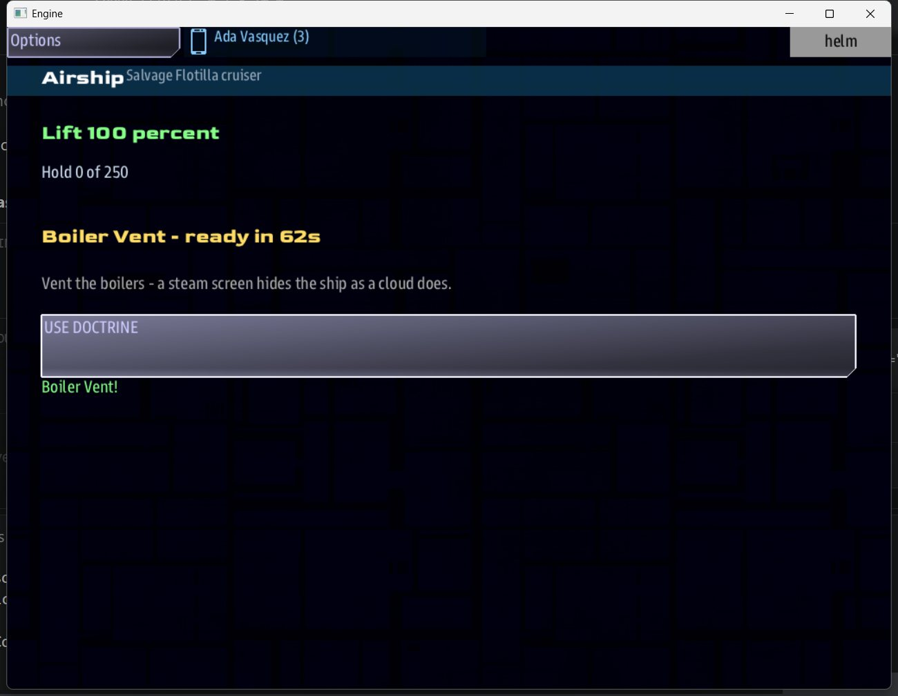

# Your airship

Every crew flies its faction's **cruiser**: the fleet flagship, with a tiered
superstructure and the most turrets of any ship.

## The Airship app

Open the **ePADD** (the tablet button at the top of any console) and tap **Airship**. The
tile itself shows your lift and whether your ability is ready, without opening anything.

| Line | Meaning |
|---|---|
| **Lift** | Green is healthy, yellow is damaged, red is in trouble. It says SINKING when you are above the altitude your lift can hold. |
| **Hold** | Cargo aboard, out of your capacity (250 for a cruiser) |
| **Ability** | READY, ACTIVE, or how long until it is ready |
| **USE DOCTRINE** | Fires your faction's [ability](factions.md#abilities) |

## Weapons

- **Missiles only.** Airships carry missile tubes, not beams.
- **Turrets defend you on their own.** Your cruiser carries separate point-defense
  turrets that fire at enemy ships, fighters and incoming missiles in range. They can be
  shot off.
- **Clouds protect you.** Enemy missiles and turrets will not fire at a ship hidden in a
  cloud. The same rule holds your turrets' fire on enemies inside one.

## Damage

Hits damage systems as usual, and they can also take out a **lift ring**. Watch the Lift
line: every lost ring lowers the highest altitude you can hold. See
[Lift](world.md#lift) for how to get it back.
