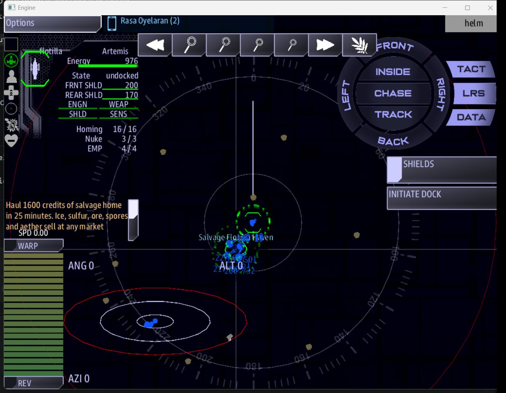

# Crew stations

The Venus missions use the standard Cosmos consoles. Here is what changes for each
station over the cloud sea.

## Helm

- **Altitude is life.** Keep an eye on the Lift line in the Airship app: with damaged
  rings your ship cannot climb as high, and it sinks toward the highest altitude it can
  still hold.
- **Ride the wind lanes** for 1.6x speed, but only while you fly with the wind.
- **Park inside resource clouds** to harvest: slow right down and sit in them.
- **Dive into a cloud** to break a missile lock.

## Weapons

- **Missiles only.** Pick your shots: turrets and point defense can stop them.
- **Your turrets fight on their own**, against ships, fighters and incoming missiles.
- **Enemy missiles and turrets will not fire at a ship hidden in a cloud.** Your turrets hold
  fire on enemies inside one too; your own missiles are yours to aim.
- Low on missiles? Trade **40 fuel** at a market for a full restock.

## Engineering

- **Lift rings are rooms.** Send damage control to the ring rooms first when lift drops;
  every ring repaired raises the altitude you can hold.
- **Storm cells** damage a random system every few seconds. Fly out of them, or plan on
  repairs.

## Science

- **Find the right clouds.** The resource clouds are coloured: blue ice, yellow sulfur,
  brown ore, green spores, violet aether, and grey wreck haze. Aether pays best.
- **Watch for raids** coming in on your flank, 5-7 km out.

## Comms

- **Markets.** Select your Haven or the Yards to **sell the hold** or **trade cargo for
  refits**. See [Markets and trade](trade.md).
- **Know your neighbors.** The [war table](factions.md#who-is-at-war-with-whom) tells you
  who will trade with you and who will shoot.

## Everyone

- **The ePADD's Airship app** shows lift, the hold and your faction's ability, and anyone
  can fire the ability from any station.
