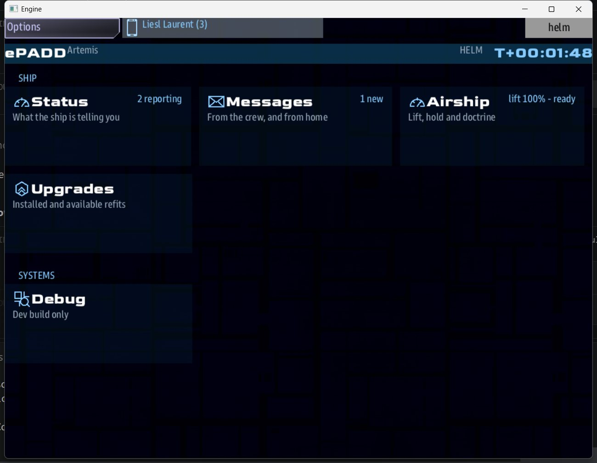

# Getting started

## Picking a mission

The host picks **Salvage Above Venus** from the mission list, then a map. Every map has a
settings panel:

| Setting | What it does |
|---|---|
| Player Ships | How many crews (1-4). More crews make the job bigger and the raids heavier. |
| Difficulty | 1-11. Raises the targets and the size and frequency of attacks. |
| Faction | Which of the [six factions](factions.md) you fly for. It decides your ship, your friends, your enemies and your special ability. |
| Game Length | Minutes on the clock (Salvage and Siege). |

The Fleet Battle map also asks for an **Enemy** faction.

!!! tip "Hosts"
    Start the map and give it a moment before the other stations connect. The server
    has to load the airship art first. If you are running a session, bake the art ahead
    of time (see the mod's README) so nobody waits in the middle of a game.

## Your first minutes

1. **Look down.** The cloud sea below is the deck. Staying out of it is the whole game.
2. **Open the ePADD** (the tablet button at the top of any console) and tap **Airship**.
   That screen shows your lift, what is in your hold, and your faction's ability.
   
3. **Find a resource cloud.** They are the coloured ones: pale blue ice, yellow sulfur,
   brown ore, green spores, violet aether, and the grey haze around wrecks.
4. **Fly into it and slow down.** Your hold fills while you sit inside it.
5. **Go home and sell** by selecting your Haven on comms. Selling also repairs your lift
   rings.

When raiders come, dive into a cloud: they cannot target what they cannot see.
