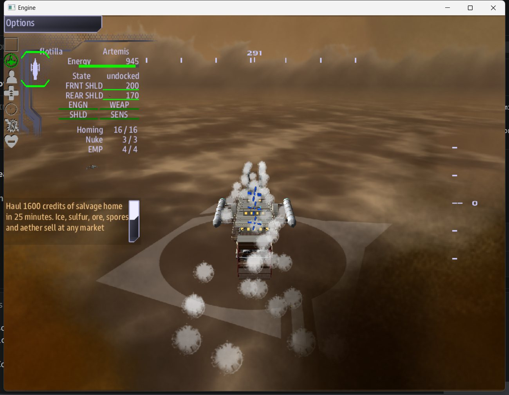

# Above the Venusian Clouds

There is no ground on Venus. There is only the cloud sea: a hot, crushing deck below and
thin, bright haze above. Everyone who lives here lives on airships, and every airship was
built from the wrecks of the starships that brought its people. Six peoples came from six
worlds, and they built six kinds of ship.

Your crew flies one of them.

## What makes this different

- **Your ship floats on lift rings, and damage takes lift away.** Lose enough and you
  **sink**. The deck below is where ships go to die. Every fight is also a race against
  your own altitude.
- **Clouds are cover.** Fly into one and enemy missiles and turrets lose you.
- **Clouds are also cargo.** Ice, sulfur, ore, spores and aether can be harvested and
  hauled home to sell, or traded for refits.
- **Ships carry missiles, not beams.** Big ships and stations bristle with separate,
  destructible turrets for point defense.
- **Six factions with different abilities.** Vent a steam screen, overcharge a reactor,
  unfurl solar sails, or regrow living flesh.

## The missions

| Mission | In one line |
|---|---|
| [Salvage Above Venus](maps/salvage.md) | Harvest the clouds and haul the cargo home before time runs out |
| [Fleet Battle Above Venus](maps/battle.md) | Fly with your navy and break the enemy's command spire |
| [Convoy to the Yards](maps/convoy.md) | Escort barges 30 km through raider country |
| [Siege of the Haven](maps/siege.md) | Hold your home spire against every hostile navy in the sky |

New here? Start with [Getting started](getting-started.md), then read about
[the sky world](world.md).
