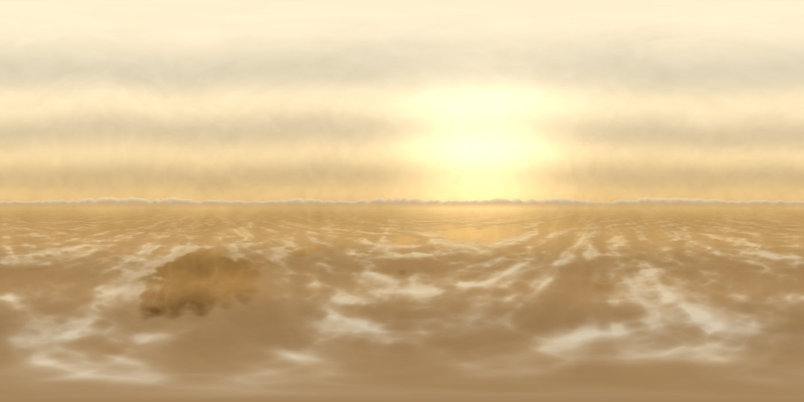
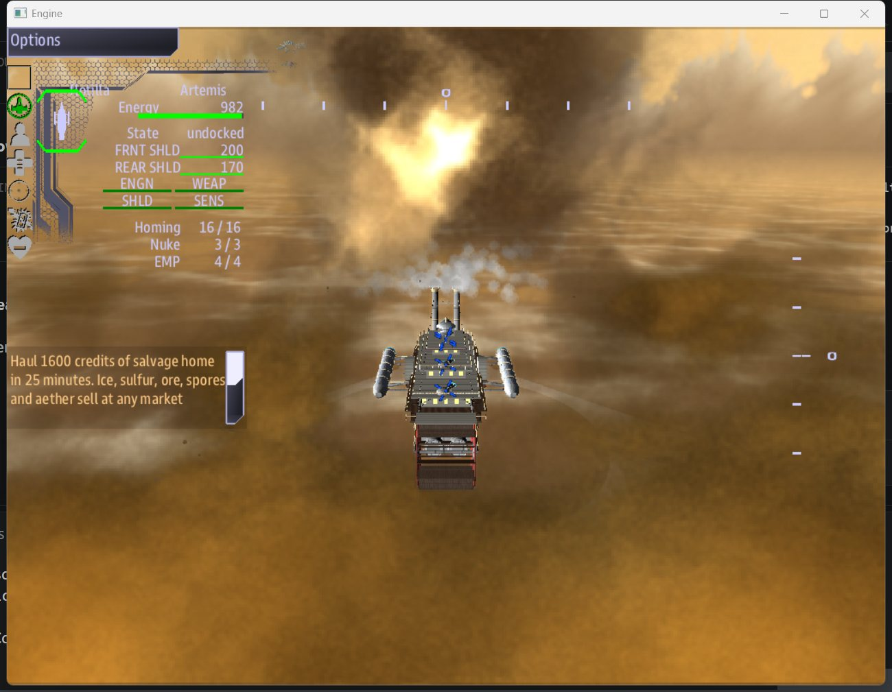

# The sky world

## Altitude

Up and down matter here, as they never do in space.

| Band | Where | What it is like |
|---|---|---|
| **Haze** | above +6000 | thin, bright, cold. Too little air to hold lift, so you cannot stay. |
| **Lanes** | between | the working sky: stations, cargo, clouds, fights |
| **Deck** | below -6000 | dark, hot, crushing. It damages you, and more the deeper you go. By -11000 you are dying. |

The sky changes as you climb or sink, so the view itself tells you where you are.

## Lift

Your airship floats on **grav-lift rings**, and each ring is a room inside your ship.
When a hit damages a ring you lose lift. The less lift you have, the lower the highest
altitude you can hold, and you sink toward it.

A ship that loses most of its lift sinks into the deck, and the deck breaks more rings.
Get out before that happens:

- **Repair the ring rooms.** Damage control on Engineering works on them like any other
  system.
- **Sell at a market.** A sale includes a full refit.
- **Dock at a market station.** Docking refits your rings for free.
- **Trade 20 aether** for a ring refit on the spot.
- **Harvest wreck salvage.** Each load patches your rings a little.

## Clouds

| Cloud | What it does |
|---|---|
| White and grey cumulus, stratus | Cover. Inside one, enemy missiles and turrets cannot see you. |
| Ice (pale blue) | Harvest for **coolant** |
| Sulfur (yellow) | Harvest for **fuel** |
| Ore dust (brown) | Harvest for **materials** |
| Spore drift (green, pulsing) | Harvest for **medicine** |
| Aether vein (violet, pulsing) | Harvest for **aether**, the most valuable cargo |
| Wreck haze (grey, with debris) | Harvest for **salvage**, which also patches your rings |
| Storm cell (dark, flickering lightning) | Cover, but it strikes your ship every few seconds and damages your systems |

A resource cloud shrinks as it is harvested and disperses when it is empty. Below the
lanes lies a layer of cloud, and below that the cloud sea itself. Both hide you as a cloud
does. The deeper you go the thicker they get, and the closer you are to the deck.

## Wind lanes

Streaks of fast wind cross the sky, marked by strings of small drifting clouds. Fly
**with** the wind and your ship goes **1.6x faster**. Flying across it or against it
gives nothing.
